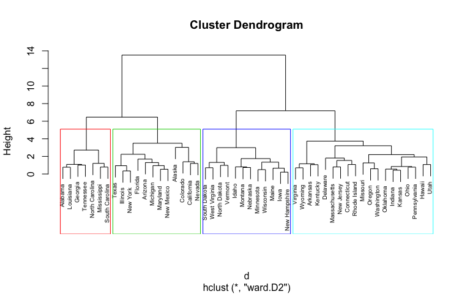

# Hierarchical-Clustering-On-MallCustomers-Datasets
Hierarchical clustering, also known as hierarchical cluster analysis, is an algorithm that groups similar objects into groups called clusters. The endpoint is a set of clusters, where each cluster is distinct from each other cluster, and the objects within each cluster are broadly similar to each other.
  
# Required data
Hierarchical clustering can be performed with either a distance matrix or raw data. When raw data is provided, the software will automatically compute a distance matrix in the background. The distance matrix below shows the distance between six objects.

# How hierarchical clustering works
Hierarchical clustering starts by treating each observation as a separate cluster. Then, it repeatedly executes the following two steps: (1) identify the two clusters that are closest together, and (2) merge the two most similar clusters. This continues until all the clusters are merged together. This is illustrated in the diagrams below.

# Measures of distance (similarity)
In the example above, the distance between two clusters has been computed based on length of the straight line drawn from one cluster to another. This is commonly referred to as the Euclidean distance. Many other distance metrics have been developed.

The choice of distance metric should be made based on theoretical concerns from the domain of study. That is, a distance metric needs to define similarity in a way that is sensible for the field of study. For example, if clustering crime sites in a city, city block distance may be appropriate (or, better yet, the time taken to travel between each location). Where there is no theoretical justification for an alternative, the Euclidean should generally be preferred, as it is usually the appropriate measure of distance in the physical world.

# Linkage Criteria
After selecting a distance metric, it is necessary to determine from where distance is computed. For example, it can be computed between the two most similar parts of a cluster (single-linkage), the two least similar bits of a cluster (complete-linkage), the center of the clusters (mean or average-linkage), or some other criterion. Many linkage criteria have been developed.

As with distance metrics, the choice of linkage criteria should be made based on theoretical considerations from the domain of application. A key theoretical issue is what causes variation. For example, in archeology, we expect variation to occur through innovation and natural resources, so working out if two groups of artifacts are similar may make sense based on identifying the most similar members of the cluster.

Where there are no clear theoretical justifications for choice of linkage criteria, Ward’s method is the sensible default. This method works out which observations to group based on reducing the sum of squared distances of each observation from the average observation in a cluster. This is often appropriate as this concept of distance matches the standard assumptions of how to compute differences between groups in statistics (e.g., ANOVA, MANOVA).

# Agglomerative versus divisive algorithms
Hierarchical clustering typically works by sequentially merging similar clusters, as shown above. This is known as agglomerative hierarchical clustering. In theory, it can also be done by initially grouping all the observations into one cluster, and then successively splitting these clusters. This is known as divisive hierarchical clustering. Divisive clustering is rarely done in practice.
 
 

