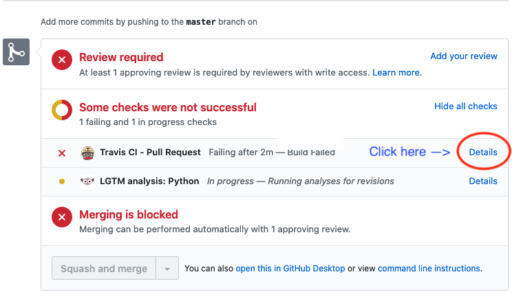
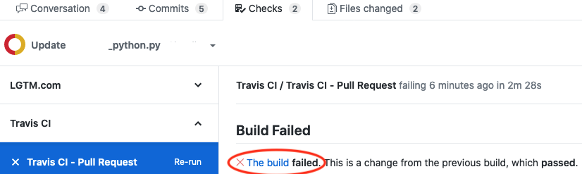

# Travis CI test are failing
### How do I find out what is wrong with my pull request?
1. In your PR look for the failing test and click the `Details` link: 
2. On the next page, click `The build failed` link: 
3. Now scroll down and look for `red` text describing the error(s) in the test log.

Pull requests will __not__ be merged if the Travis CI tests are failing.

If anything is unclear, please read through [CONTRIBUTING.md](CONTRIBUTING.md) and attempt to run the failing tests on your computer before asking for assistance.
